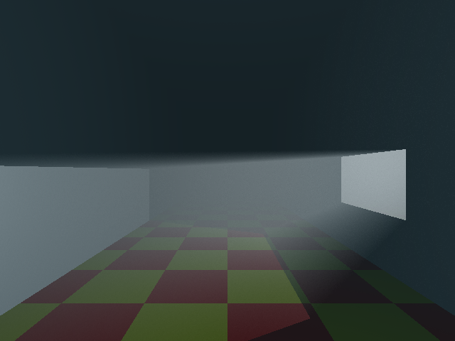
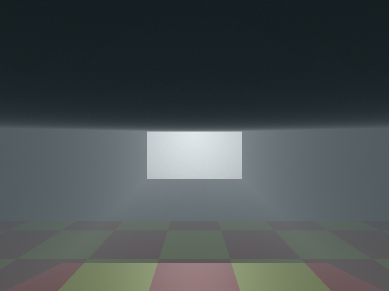
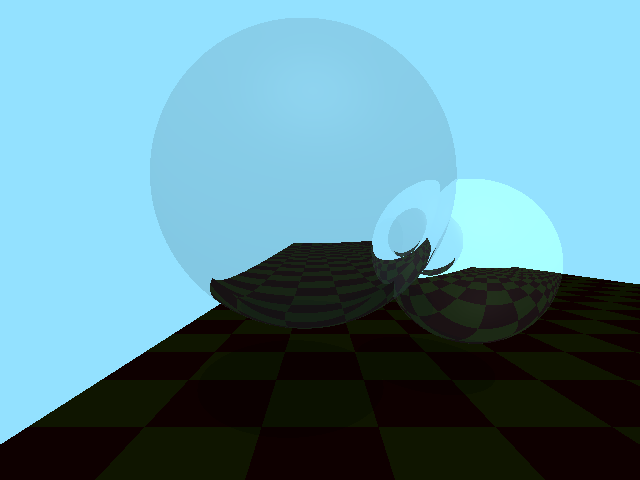
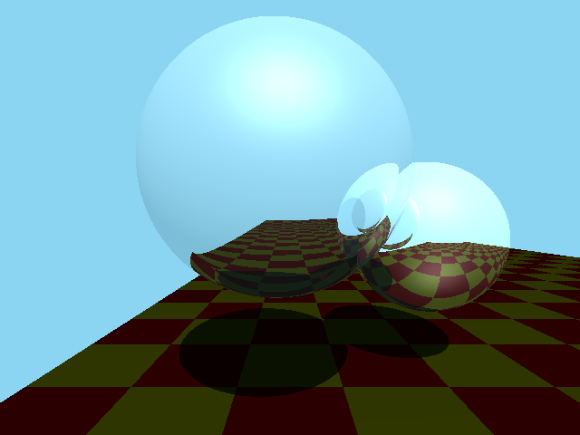
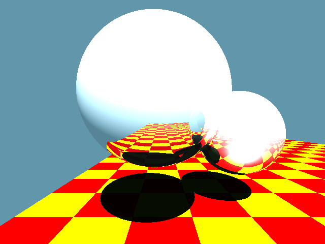

  
# Overview
This is a repository that holds all the code and renders from my rust raytracer. This raytracer supports k-d trees for navigating complex scenes efficiently, volumetrics, and tone-mapping.

# Final Project Report
## Intro
For my final project, I added volumetrics to my raytracer. The main reason I wanted to do this was to get godrays, and I was able to do so! Currently the project has support for a global volume, and creates anistrophic fog.

## Architecture
I was using Rust for my raytracer throughout the semester. I found packages that easily let me create images and perform calculations using vectors and matrices. The raytracer itself is split up into 5 files, one for the main raytracer functionality like the camera, one for lighting, one for implementing .ply models like the Stanford bunny, one for my primitives, and one for the scene/world.

I used algorithms and formulas from the paper [“Efficient Monte Carlo Methods for Light Transport in Scattering Media”](https://cs.dartmouth.edu/~wjarosz/publications/dissertation/) by Wojciech Jarosz.

## Systems
For the volumetrics themselves, I added a seperate function to my world which allows the camera to use volumetric rays instead of regular rays. These rays have a global volume and calculate scattering through the medium. This is done through Monte Carlo ray marching down the ray through the fog, calculating single-scatter at each step. I used the Henyey-Greenstein phase function for anisotropic fog.

## Results
All these results are anisotropic fog with Henyey-Greenstein phase and in-scattering is exaggerated for more distinct rays.
Tone mapping is done with Ward’s operator.

g=0.6, in-scattering x 5.0  

g=0.1, in-scattering x 10.0  

## Future work
There are quite a few hardcoded values and functionality, and I hope to make the raytracer more modular and multi-functional. I also want to be able to potentially make this use the GPU and be real-time at some point.
I would also like to implement radiance caching from Jarosz’s paper to help speed up scattering, and area lights rather than just point lights.

# Checkpoint 1

# Checkpoint 2

# Checkpoint 3

# Checkpoint 4

# Checkpoint 5

# Checkpoint 6

# Checkpoint 7
## Ward
Low-range lighting  

  

Mid-range lighting  

  

High-range lighting  

## Reinhard
Low-range lighting  

  

Mid-range lighting  

  

High-range lighting  

# Advanced Checkpoint: K-D Tree
Time to construct K-D tree: 0.5 seconds  
Time to render with K-D tree: 5 seconds  
Time to render without k-D tree: TOO LONG    

# Advanced Checkpoint: Advanced Tone Mapping
## Low-range lighting
Ward  

  

Adaptive  

  
## Mid-range lighting
Ward  

  

Adaptive  

## High-range lighting
Ward  

  

Adaptive  

