## Overview
This is a repository that holds all the code and renders from my rust raytracer. This raytracer supports k-d trees for navigating complex scenes efficiently, volumetrics, and tone-mapping.

## Final Project Report
### Intro
For my final project, I added volumetrics to my raytracer. The main reason I wanted to do this was to get godrays, and I was able to do so! Currently the project has support for a global volume, and creates anistrophic fog.

### Architecture
I was using Rust for my raytracer throughout the semester. I found packages that easily let me create images and perform calculations using vectors and matrices. The raytracer itself is split up into 5 files, one for the main raytracer functionality like the camera, one for lighting, one for implementing .ply models like the Stanford bunny, one for my primitives, and one for the scene/world.

### Systems
For the volumetrics themselves, I added a seperate function to my world which allows the camera to use volumetric rays instead of regular rays. These rays have a global volume and calculate scattering through the medium. This is done through Monte Carlo ray marching down the ray through the fog, calculating single-scatter at each step.

### Results
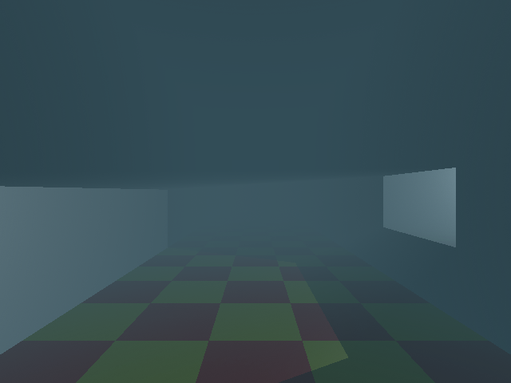
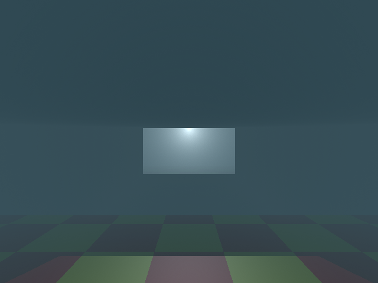
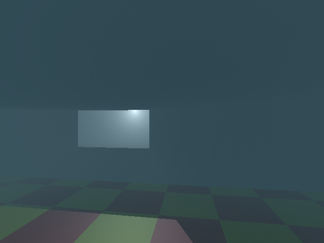

### Future work
There are quite a few hardcoded values and functionality, and I hope to make the raytracer more modular and multi-functional. I also want to be able to potentially make this use the GPU and be real-time at some point.

## Checkpoint 1
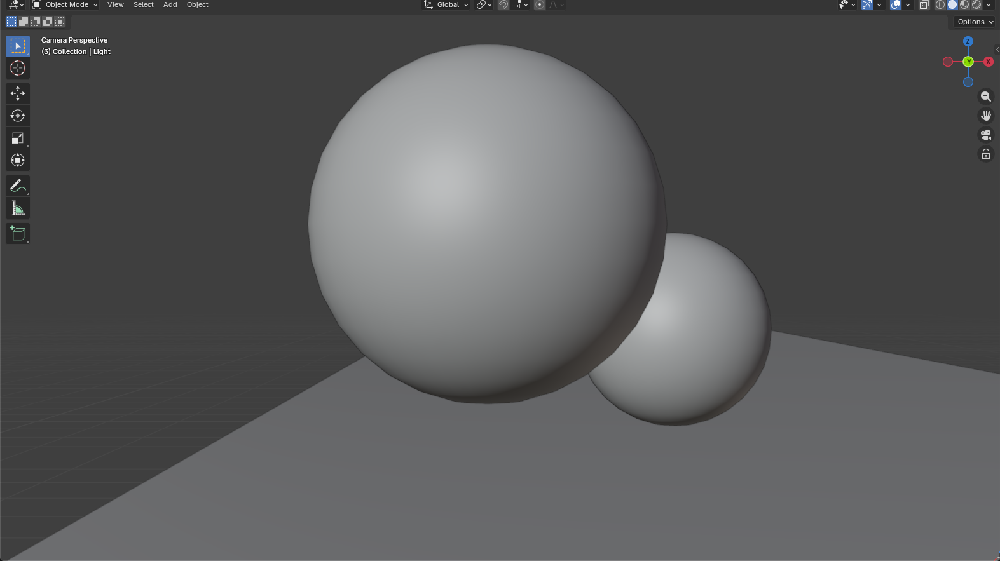

## Checkpoint 2
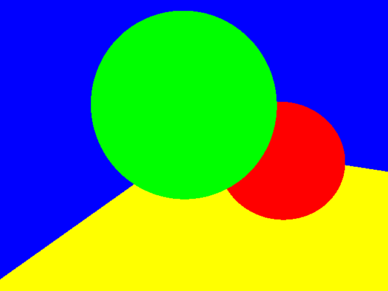
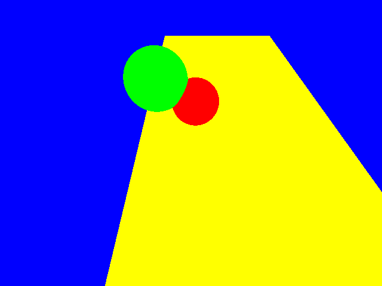

## Checkpoint 3
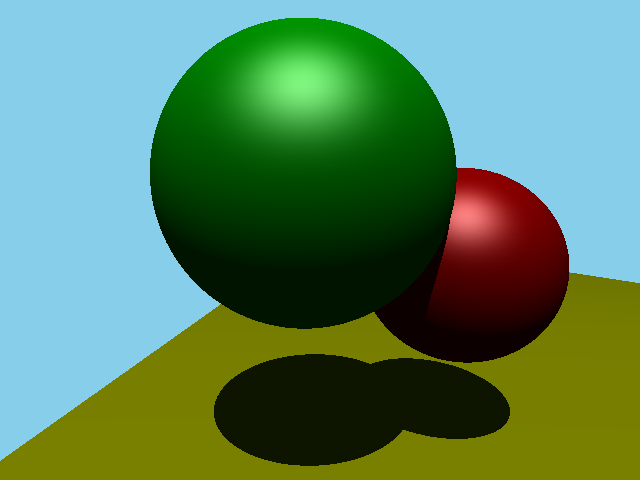
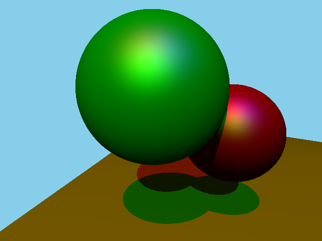

## Checkpoint 4
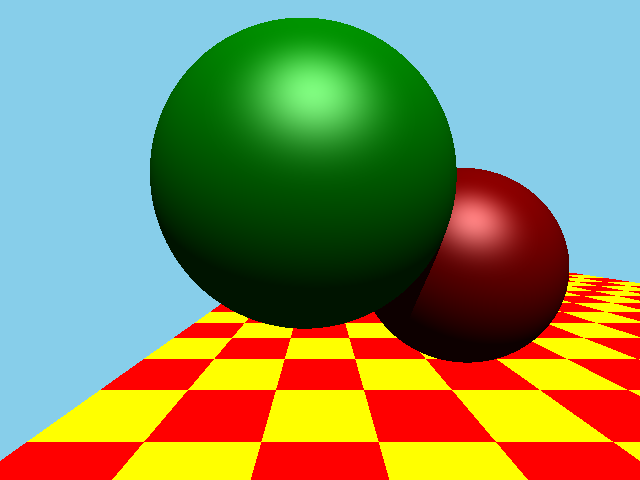

## Checkpoint 5
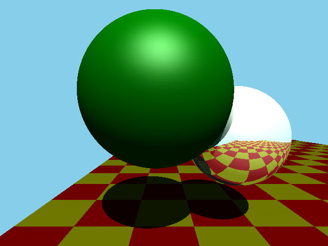

## Checkpoint 6
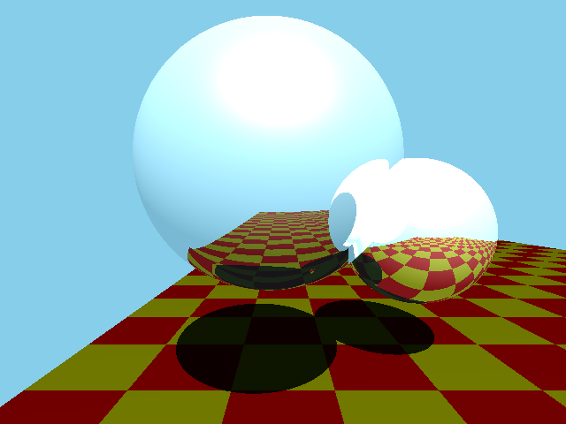

## Checkpoint 7
### Ward
#### Low-range lighting
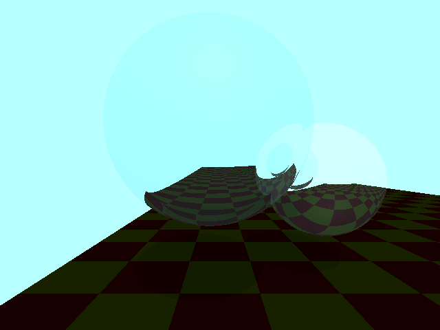
#### Mid-range lighting
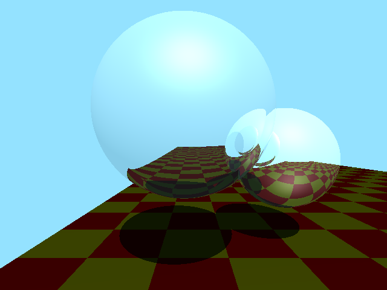
#### High-range lighting
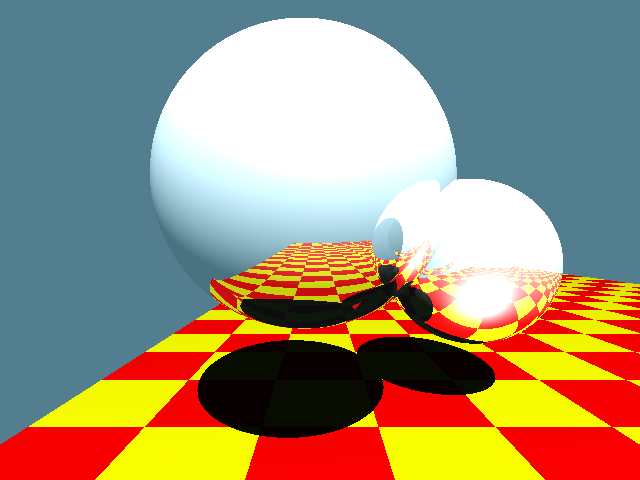

### Reinhard
#### Low-range lighting
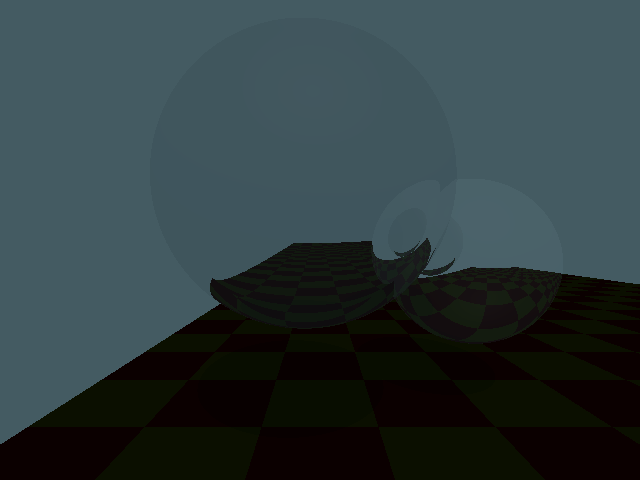
#### Mid-range lighting
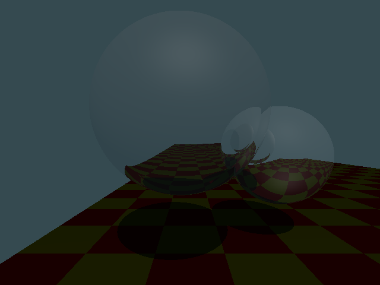
#### High-range lighting
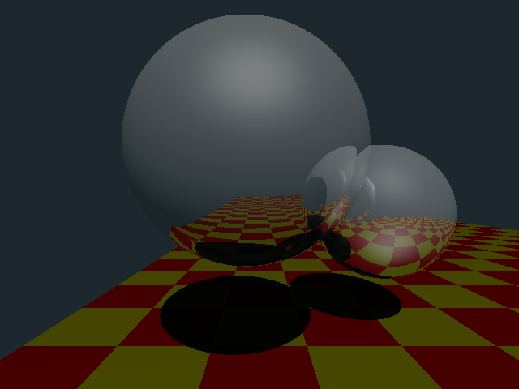

## Advanced Checkpoint: K-D Tree
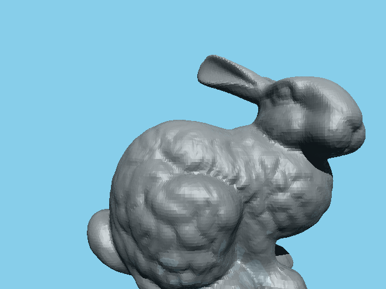

## Advanced Checkpoint: Advanced Tone Mapping
